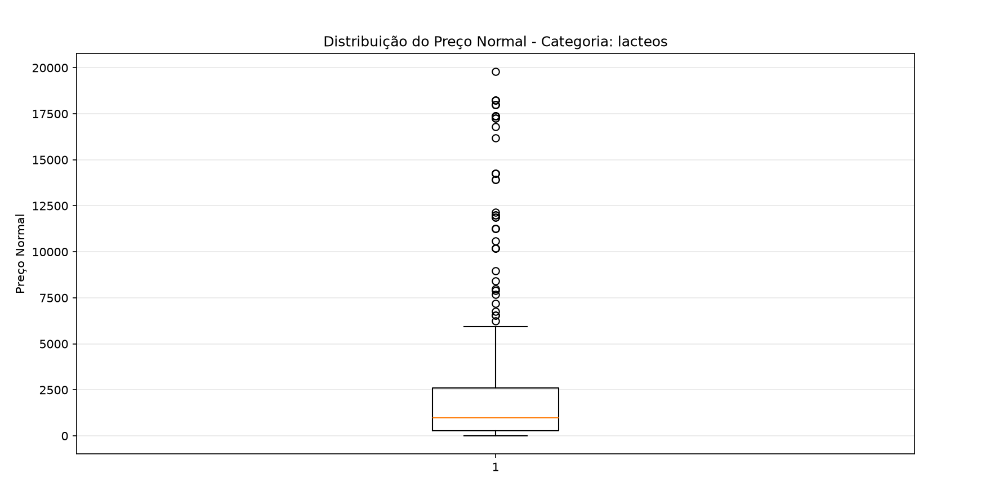
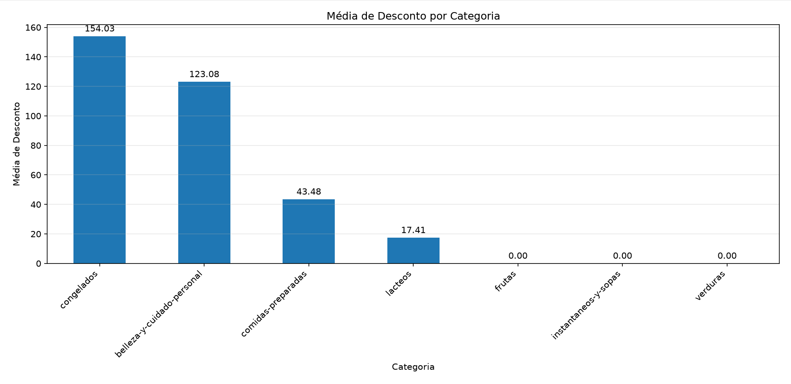
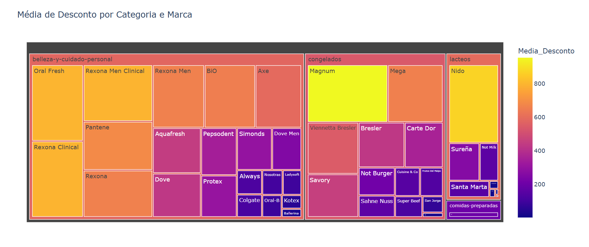

# 🛒 Análise de Dados de Supermercado

## 📌 Sobre o projeto

Este projeto apresenta uma análise exploratória de dados de produtos de um supermercado, utilizando Python para aplicar conceitos de estatística descritiva e visualização de dados.

O objetivo é explorar os preços e descontos dos produtos, identificando padrões, diferenças entre categorias e possíveis valores discrepantes (outliers).

A análise foi desenvolvida como parte de um projeto acadêmico de fundamentos da descoberta de dados.

## 🎯 Objetivos

Durante o projeto, foram realizadas as seguintes análises:

- Cálculo da média e mediana dos preços por categoria;
- Análise do desvio padrão dos preços;
- Identificação da categoria com maior dispersão;
- Utilização de boxplot para análise da distribuição e identificação de possíveis outliers;
- Análise da média de descontos por categoria;
- Criação de uma visualização interativa relacionando categorias e marcas.

## 🔎 Principais insights

A análise permitiu identificar diferenças relevantes entre as categorias de produtos.

- A categoria **lacteos** apresentou o maior desvio padrão dos preços;
- A diferença entre média e mediana nessa categoria indica uma distribuição influenciada por valores elevados;
- O boxplot revelou a presença de diversos possíveis outliers;
- A categoria **congelados** apresentou a maior média de descontos;
- A visualização interativa possibilitou explorar os descontos considerando categoria e marca.

Esses resultados demonstram como técnicas de estatística descritiva e visualização podem ser utilizadas para transformar dados brutos em informações relevantes para análise.

## 🛠️ Tecnologias utilizadas

- Python
- Pandas
- Matplotlib
- Plotly
- Jupyter Notebook

## 📊 Visualizações

### Distribuição de preços - Categoria Lácteos (Boxplot)


A categoria **lácteos**, que apresentou o maior desvio padrão, mostra forte concentração de preços em valores baixos, com diversos outliers acima do limite superior.

### Média de desconto por categoria


A categoria **congelados** se destaca com a maior média de desconto, seguida por **belleza-y-cuidado-personal**.

### Desconto por categoria e marca (visualização interativa)


Treemap interativo relacionando categorias, marcas e a média de desconto aplicada.

## 📂 Estrutura do projeto
```text
projeto-supermercado/
│
├── projeto_supermercado.ipynb
├── MODULO7_PROJETOFINAL_BASE_SUPERMERCADO.csv
├── README.md
└── imagens/
    ├── boxplot_lacteos.png
    ├── grafico_barras_desconto.png
    └── treemap_desconto_categoria_marca.png
```
